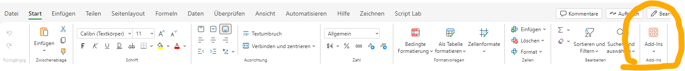
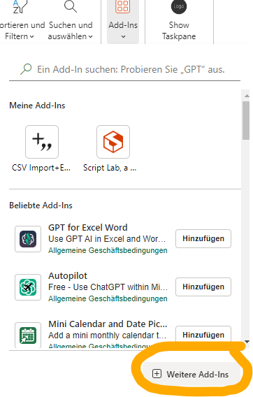
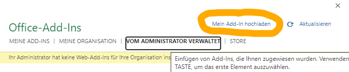

# Controlling_Excel_Addin

Excel Add-In for manipulating "controlling data" using JavaScript.

## User Setup


1. **Download the `manifest.xml` file.**
   [Download manifest.xml](https://qsh1nethd.github.io/manifest.xml)

2. **Open Excel Online and Load the `manifest.xml`:**

   <details>
   <summary>View Screenshots</summary>

   > **Note:** 
   If the screenshots aren't being displayed properly, you can open the README on Gist at: [Kreis TRADE Add-In Readme](https://gist.github.com/TechDevAlex/d2cf78ba8cbfe34ac3a3c816ddf28772)


   - **Open Excel Add-Ins:**

     

   - **Select Further Add-ins:**
   
     


   - **Select "Managed by the Administrator" and "Upload My Add-in":**

     

   </details>

3. **Download the Test Data:**

   
   - Download a .csv from neon.adito controlling, using the export template (Exportvorlage) "KREISHANDEL - ExportAufwände".
   - or download a example Adito .csv dataset (w.i.p.)
   - or download the test data file to use with your Excel add-in
   [Test Data](https://qsh1nethd.github.io/data/Fictional_Controlling_Februar.csv)

4. **Open an Excel File:**

   - Open an Excel file containing the "Kreis TRADE - 2024" sheet, or download the example excel sheet (only available for adito employees).<br>
   [Excel Vorlage](https://aditosoftware-my.sharepoint.com/:x:/r/personal/a_stahl_aditosoftware_onmicrosoft_com/_layouts/15/Doc.aspx?sourcedoc=%7B20E4EA2F-3183-4C15-98AE-45C97C005525%7D&file=Exportvorlage_Testmappe.xlsx&action=default&mobileredirect=true)

   Note: The sheet names are currently hard-coded! 
   If you create your own excel file, the sheets need to be named EXACTLY
   "Kreis TRADE - 2024"
   and "ExportDaten"

   - Create a new (or open an existing) "ExportDaten" sheet and insert the test data via manual copy-paste or a .csv loading Add-In. <br>
   Note: The Add-In "CSV Import+Export" from Emurasoft Inc. is a free and convenient option.

5. **Open the Application:**

   - Use the "Show Taskpane" button next to "Add-Ins" to open the application.

6. **Click the "Kreis Trade Export" Button:**

   - You should now see the application!

7. **Try out the "Extract employee working hours from .csv"**
   <details>
   <summary> Feature Tutorial </summary>
   - Autodetect should already have selected the correct month, otherwise change it manually

   - Select an employee or "Alle"

   - Select a category

   - Copy or write a Formula hat determines how to calculate the category. The Application will search for the corresponding month, employee name and category in "Kreis TRADE -2024" and apply the formula to the selection.

   - A. You can copy formulas from the [Formula Examples](https://qsh1nethd.github.io/QuestionsAndDoku/Formula_Examples.txt)
   
   - B. If you have some JavaScript experience, or through the use of an AI-Tool, you can easily enter a custom javascript Formula. For recurring problems (e.g. finding a column index via name), helper functions are implemented. 
   The available helper functions can be found at [Helper Functions](https://qsh1nethd.github.io/QuestionsAndDoku/Helper_Functions.txt)  
   </details>

## Troubleshooting

- If the application does not load, click the "Preview App" button to open it on [https://qsh1nethd.github.io/](https://qsh1nethd.github.io/) to verify if the server-side application is running.

---

## Developer Setup

1. **Pull the Git Project:**

   - Clone the repository to your local machine.

2. **Download and Install Node.js:**

   - Get Node.js from [https://nodejs.org/en](https://nodejs.org/en).

3. **Install Dependencies:**

   - Navigate to the root of the Git project and run the following commands:

     ```bash
     npm install
     npm start
     ```

   - Accept any Node.js security notifications.

4. **Open Excel Online:**

   - Open the `manifest_local_dev.xml` via the Add-ins tab.

   - Note: Excel Offline does not have the browser's "console," making debugging more challenging.

## DevNotes:

- When loading a new version of the `manifest.xml`, clear the browser cache and refresh the website to ensure the latest version is used.

---
